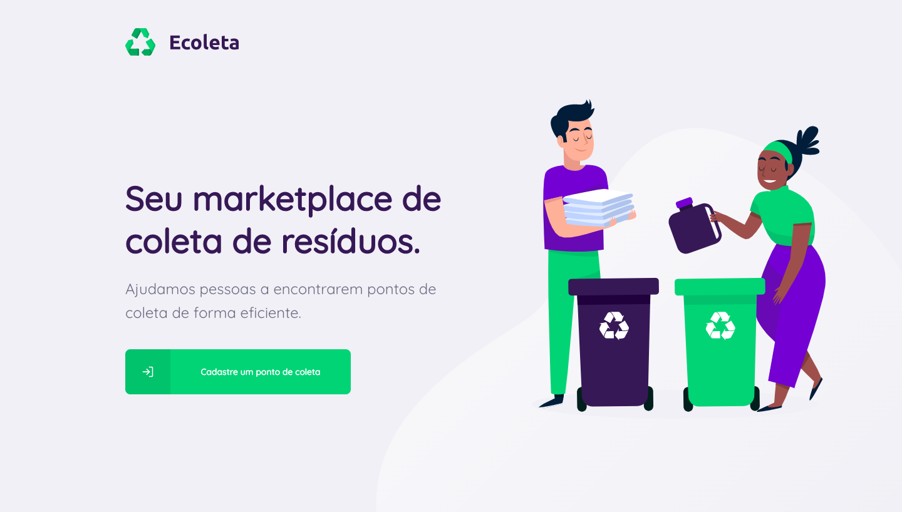

 
    <h1> :recycle: Ecoleta </h1>
    
 Marketplace para coleta de resíduos desenvolvido na next level week 

    

<h2> :zap: Sobre o projeto </h2>

 Construída para conectar pessoas  empresas de coleta de resíduos. Na aplicação web as empresas poderão se cadastrar informando seus dados, localização e os ítens que coleta, entre eles estão: 

<ul>
    <li> lâmpadas</li>
    <li> pilhas e baterias </li>
    <li> papéis e papelão </li>
    <li> resíduos eletrônicos </li>
    <li> resíduos orgânicos </li>
    <li> óleo de cozinha </li>
</ul>

 No app os usuários poderão encontrar no mapa pontos de coleta próximos e entrar em contato com as instituições pelo Whatsapp ou email. 

 Essa aplicação foi desenvolvida na trilha <strong>Booster</strong> da <strong>Next Level Week</strong> distribuída pela Rocketseat.

<h2> :rocket: Techs </h2>
<ul>
    <li>Node.js</li>
    <li>React</li>
    <li>React Native</li>
    <li>Typescript</li>
</ul>

<h2> 📗 License </h2>

 Esse projeto está sob o MIT. Veja mais no arquivo <a href='./LICENSE'>LICENSE</a>

<strong>Feito com 💚 por Vitória Tenório</strong>

